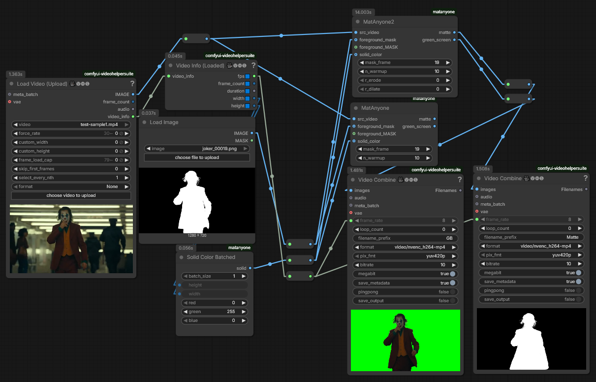

# ComfyUI-MatAnyone

MatAnyone in ComfyUI (Remove background)

Stable Video Matting with Consistent Memory Propagation: <https://github.com/pq-yang/MatAnyone>

Scaling Video Matting via a Learned Quality Evaluator: <https://github.com/pq-yang/MatAnyone2>

Download `matanyone.pth` from <https://github.com/pq-yang/MatAnyone?tab=readme-ov-file#download-model>

Download `matanyone2.pth` from <https://github.com/pq-yang/MatAnyone2?tab=readme-ov-file#-inference>

```bash
checkpoint/
    matanyone.pth
    matanyone2.pth
```

## Workflow

[workflow/workflow_mat_anyone.json](workflow/workflow_mat_anyone.json)


(Not a workflow-embedded image)

Inputs:

- src_video
- `forground_mask` (`IMAGE`) or `foreground_MASK` (`MASK`): The input mask. IMAGE option will automatically convert a black/white image to a mask. At least one option must be given.
- `solid_color` (optional): The solid color to create a screen. Defaults to Green Screen.
- `mask_frame`: The input mask's index (defaults to 0). Support first (0), last and middle frame.
- `n_warmup`: Number of iterations to warm up the model. Defaults to 10.

Your input mask won't actually be in the final matte. Instead, the warmup process generate a new input mask, which is then propagated throughout the video.

### MatAnyone 2 Support

The extension now includes the `MatAnyone2Video` node, which runs the improved MatAnyoneV2 model for higher-quality and more robust video matting.

**Workflow V2**: [workflow/workflow_mat_anyone_v2.json](workflow/workflow_mat_anyone_v2.json)


(Not a workflow-embedded image)

Additional Inputs for V2:
- `r_erode` (optional): The radius for morphological erosion applied to the `foreground_mask` before processing (defaults to 0). Useful for refining rough masks.
- `r_dilate` (optional): The radius for morphological dilation applied to the `foreground_mask` before processing (defaults to 0).

## Credit

```cite
@InProceedings{yang2025matanyone,
    title     = {{MatAnyone}: Stable Video Matting with Consistent Memory Propagation},
    author    = {Yang, Peiqing and Zhou, Shangchen and Zhao, Jixin and Tao, Qingyi and Loy, Chen Change},
    booktitle = {arXiv preprint arXiv:2501.14677},
    year      = {2025}
}

@InProceedings{yang2026matanyone2,
   title     = {{MatAnyone 2}: Scaling Video Matting via a Learned Quality Evaluator},
   author    = {Yang, Peiqing and Zhou, Shangchen and Hao, Kai and Tao, Qingyi},
   booktitle = {CVPR},
   year      = {2026}
   }
```
