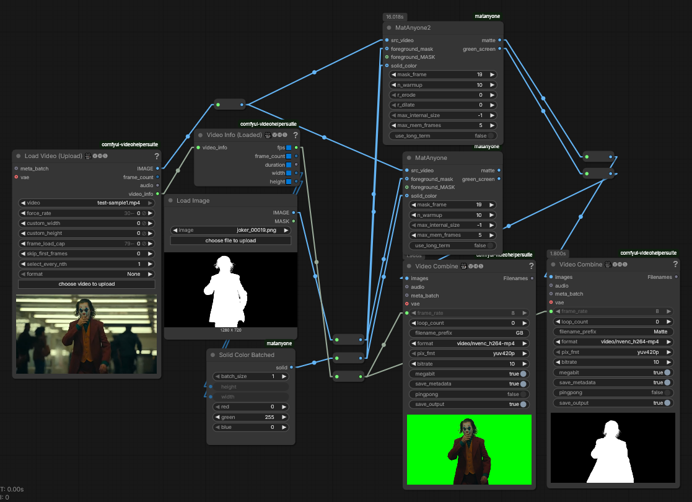

# ComfyUI-MatAnyone-custom

Custom MatAnyone2 node for ComfyUI, based on
[FuouM/ComfyUI-MatAnyone](https://github.com/FuouM/ComfyUI-MatAnyone).

## MatAnyone2 batch-mask guidance

The `MatAnyone2` node accepts either one mask or a frame-aligned mask batch.
The original `MatAnyone` node is unchanged.

- `first_valid_then_propagate` (default): scans the supplied batch, ignores fully
  black masks, starts at the first valid mask, and propagates that one mask
  through the whole video. A single mask still uses `mask_frame` for backwards
  compatibility.
- `valid_per_frame_then_propagate`: injects every valid mask at its corresponding
  video frame. If a frame has a fully black mask, has no supplied mask, or was
  missed by the detector, MatAnyone2 propagates from its previous memory instead.
- `mask_valid_threshold`: optional maximum-pixel threshold used to classify a
  mask as valid. The default `0.0` means only completely black masks are skipped.

## Upstream documentation

MatAnyone in ComfyUI (Remove background)

Stable Video Matting with Consistent Memory Propagation: <https://github.com/pq-yang/MatAnyone>

Scaling Video Matting via a Learned Quality Evaluator: <https://github.com/pq-yang/MatAnyone2>

Download `matanyone.pth` from <https://github.com/pq-yang/MatAnyone?tab=readme-ov-file#download-model>

Download `matanyone2.pth` from <https://github.com/pq-yang/MatAnyone2?tab=readme-ov-file#-inference>

```bash
checkpoint/
    matanyone.pth
    matanyone2.pth
```

https://github.com/user-attachments/assets/f1805028-92ed-40b7-8bf5-85f1a3ddbe25

## Workflow

The extension now includes the `MatAnyone2Video` node, which runs the improved MatAnyoneV2 model for higher-quality and more robust video matting.

**Workflow**: [workflow/workflow_mat_anyone.json](workflow/workflow_mat_anyone.json)


(Not a workflow-embedded image)

Inputs:

- src_video
- `forground_mask` (`IMAGE`) or `foreground_MASK` (`MASK`): The input mask. IMAGE option will automatically convert a black/white image to a mask. At least one option must be given.
- `solid_color` (optional): The solid color to create a screen. Defaults to Green Screen.
- `mask_frame`: The input mask's index (defaults to 0). Support first (0), last and middle frame.
- `n_warmup`: Number of iterations to warm up the model. Defaults to 10.

**Memory Management Inputs**:

- `max_internal_size` (optional): Resizes the internal processing resolution to save memory (e.g., 360, 480). Default is -1 (full resolution).
- `max_mem_frames` (optional): The number of key frames kept in high-resolution working memory. Default is 5.
- `use_long_term` (optional): Limits active memory scaling by compressing older frames into long-term prototype memories, preventing OOM over time. Default is False. (Useful for long videos)

Your input mask won't actually be in the final matte. Instead, the warmup process generate a new input mask, which is then propagated throughout the video.

Additional Inputs for V2:

- `r_erode` (optional): The radius for morphological erosion applied to the `foreground_mask` before processing (defaults to 0). Useful for refining rough masks.
- `r_dilate` (optional): The radius for morphological dilation applied to the `foreground_mask` before processing (defaults to 0).

## Credit

```cite
@InProceedings{yang2025matanyone,
    title     = {{MatAnyone}: Stable Video Matting with Consistent Memory Propagation},
    author    = {Yang, Peiqing and Zhou, Shangchen and Zhao, Jixin and Tao, Qingyi and Loy, Chen Change},
    booktitle = {arXiv preprint arXiv:2501.14677},
    year      = {2025}
}

@InProceedings{yang2026matanyone2,
   title     = {{MatAnyone 2}: Scaling Video Matting via a Learned Quality Evaluator},
   author    = {Yang, Peiqing and Zhou, Shangchen and Hao, Kai and Tao, Qingyi},
   booktitle = {CVPR},
   year      = {2026}
}
```
